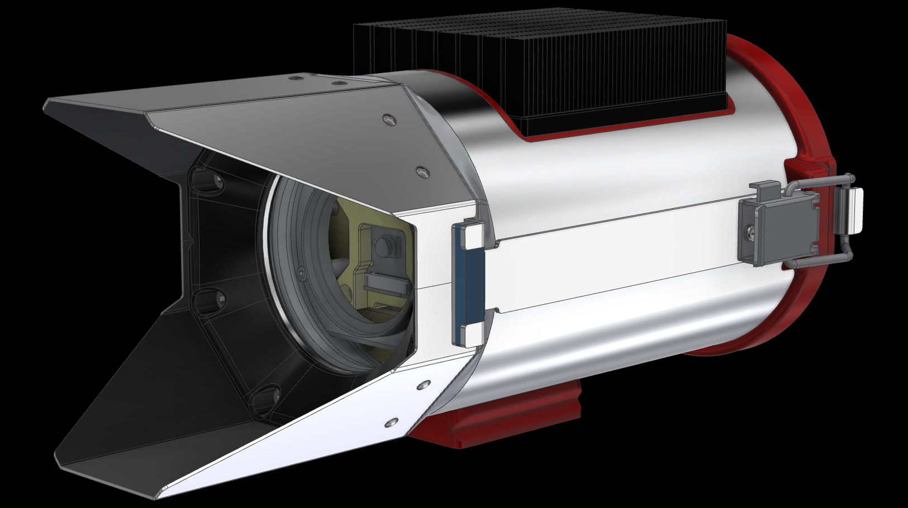

# perception_camera_app

 

## What is it?
Application for perception_camera.

## How it works.
This application is depends on zeromq and protocol buffers.

<iframe class="hatenablogcard" style="width:100%;height:155px;max-width:450px;" title="embree" src="https://hatenablog-parts.com/embed?url=https://zeromq.org/" width="300" height="150" frameborder="0" scrolling="no"> </iframe>

zeromq can transfer string via tcp/udp/icp.  
Data which you want to send via zeromq serialized by protocol buffers.  

## Code Example
### Acquire image and publish.

image_acquisition.cpp

```c++
#include <image_acquisition/image_acquisition.hpp>
#include <iostream>

namespace perception_camera_app {
ImageAcquisition::ImageAcquisition(const zmqpp::context &context,
                                   uint32_t width, uint32_t height,
                                   uint32_t frame_rate)
    : width(width), height(height), frame_rate(frame_rate),
      capture_duration(1.0 / static_cast<double>(frame_rate)),
      publisher_(context) {}

void ImageAcquisition::open() {
  while (!capture_ || !capture_->isOpened()) {
    std::cout << "Try opening video device...." << std::endl;
    capture_ = std::make_shared<cv::VideoCapture>(getGstreamerPipeline(),
                                                  cv::CAP_GSTREAMER);
    std::this_thread::sleep_for(std::chrono::seconds(1));
  }
}

void ImageAcquisition::capture() {
  if (!capture_ || !capture_->isOpened()) {
    open();
  }
  while (true) {
    const auto capture_time = std::chrono::system_clock::now();
    const auto next_capture_time =
        capture_time +
        std::chrono::milliseconds(static_cast<int>(capture_duration));
    cv::Mat image;
    if (!capture_->read(image)) {
      break;
    }
    publisher_.publish(perception_camera_app::convert(image, capture_time));
    const auto now = std::chrono::system_clock::now();
    if (next_capture_time >= now) {
      continue;
    } else {
      const auto sleep_duration = next_capture_time - now;
      std::this_thread::sleep_for(sleep_duration);
      continue;
    }
  }
}

std::string ImageAcquisition::getGstreamerPipeline() const {
  return "nvarguscamerasrc ! video/x-raw(memory:NVMM), width=(int)" +
         std::to_string(width) + ", height=(int)" + std::to_string(height) +
         ", framerate=(fraction)" + std::to_string(frame_rate) +
         "/1 ! nvvidconv flip-method=" + std::to_string(0) +
         " ! video/x-raw, width=(int)" + std::to_string(width) +
         ", height=(int)" + std::to_string(height) +
         ", format=(string)BGRx ! videoconvert ! video/x-raw, "
         "format=(string)BGR ! appsink";
}
} // namespace perception_camera_app
```

In image acquisition, application get image via gstreamer and publish images as serialized zeromq message string.
